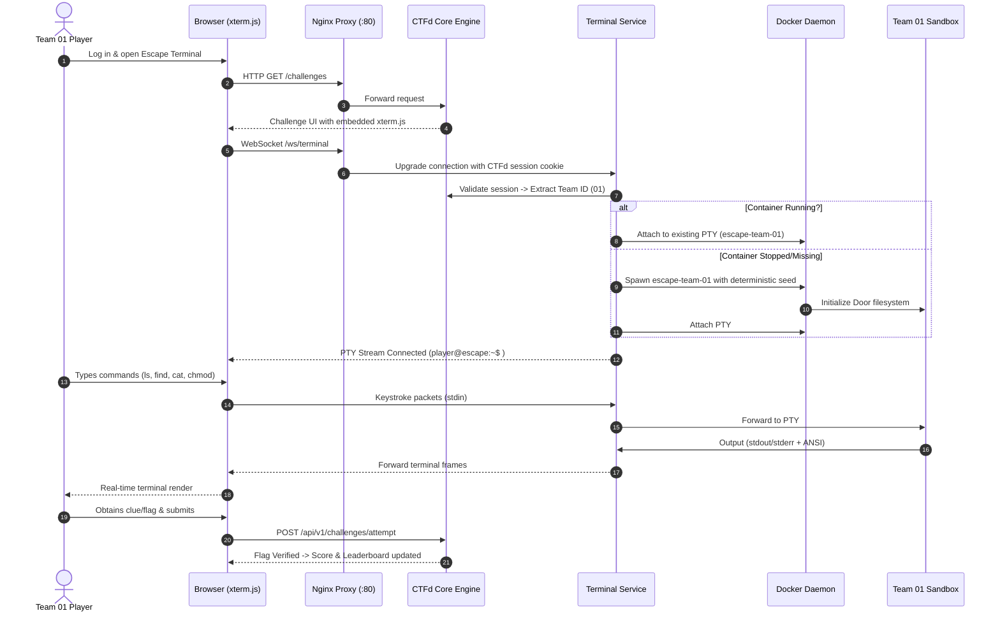

# 🐧 ESCAPE THE TERMINAL — System Architecture

## 1. System Overview

**ESCAPE THE TERMINAL** is a zero-cost, self-hosted Linux escape-room competition platform designed for college local-area networks (LAN). The platform couples the battle-tested, open-source **CTFd** competition engine with a high-performance **Custom Terminal & Container Management Engine** to provide 30–40 simultaneous teams with isolated, deterministic, browser-based Linux environments.

```
                          COLLEGE LOCAL AREA NETWORK (LAN)
                                [192.168.1.0/24]
                                       │
                                       ▼
                       ┌───────────────────────────────┐
                       │      Nginx Reverse Proxy      │
                       │           (Port 80)           │
                       └───────────────┬───────────────┘
                                       │
                ┌──────────────────────┴──────────────────────┐
                │ HTTP Requests                               │ WebSocket Connections
                ▼                                             ▼
  ┌───────────────────────────┐                 ┌───────────────────────────┐
  │           CTFd            │  Auth Token /   │      Escape Terminal      │
  │     Competition Core      │◄────────────────┤          Service          │
  │ (Auth, Teams, Scoreboard) │  Team Identity  │ (FastAPI / PTY Multiplex) │
  └─────────────┬─────────────┘                 └─────────────┬─────────────┘
                │                                             │
      ┌─────────┴─────────┐                                   │ Docker Engine API
      ▼                   ▼                                   ▼
┌───────────┐       ┌───────────┐               ┌───────────────────────────┐
│PostgreSQL │       │   Redis   │               │     Container Manager     │
│ Database  │       │   Cache   │               │  (Lifecycle & Isolation)  │
└───────────┘       └───────────┘               └─────────────┬─────────────┘
                                                              │
                    ┌─────────────────────────────────────────┼─────────────────────────────────────────┐
                    ▼                                         ▼                                         ▼
      ┌───────────────────────────┐             ┌───────────────────────────┐             ┌───────────────────────────┐
      │   Team 01 Sandbox (PTY)   │             │   Team 02 Sandbox (PTY)   │             │   Team 30 Sandbox (PTY)   │
      │ 0.5 CPU / 256MB / non-root│  [ISOLATED] │ 0.5 CPU / 256MB / non-root│  [ISOLATED] │ 0.5 CPU / 256MB / non-root│
      │   Deterministic Seed A    │             │   Deterministic Seed B    │             │   Deterministic Seed N    │
      └───────────────────────────┘             └───────────────────────────┘             └───────────────────────────┘
```

---

## 2. Core Architectural Layers

### Layer 1: CTFd Competition Management Engine
CTFd acts as the single source of truth for all competitive dynamics:
- **Authentication & Authorization**: Participant registrations, passwords, and sessions.
- **Team Management**: Team formation, team captaincy, roster limits (2–3 players/team), and team ID assignment.
- **Challenge Hierarchy**: Progressive doors (Door 1 through Door 6 / Final), hints, and point values.
- **Scoring & Leaderboard**: Real-time standings, solve timestamps, penalty deduction, and freeze states.
- **Admin Control**: Competition timer start/pause/resume, event broadcasts, and submission auditing.

CTFd core source code is untouched; all extensions interact via documented CTFd plugin hooks and standard REST APIs.

### Layer 2: Custom Terminal Plugin & Terminal Service
To allow participants to interact with their container directly inside their web browser:
1. **Frontend Terminal Component**: Uses `xterm.js` embedded in the CTFd challenge interface.
2. **WebSocket Gateway**: Maintains full-duplex communication (`/ws/terminal/{team_id}`).
3. **Session Verification**: When a WebSocket handshake arrives, the terminal service validates the user's session cookie / JWT against CTFd. The container attached **must** match the authenticated user's `team_id`.
4. **PTY Multiplexing**: Connects the WebSocket stream to a Linux pseudo-terminal (PTY) attached to the running container (`docker exec` with PTY allocation). Supports resize events (`SIGWINCH`), Ctrl+C (`SIGINT`), ANSI color codes, and buffer re-synchronization.

### Layer 3: Container Manager & Deterministic Generation
The Container Manager lifecycle engine provisions and manages sandboxes:
- **On-Demand or Pre-Warmed Provisioning**: Creates and verifies containers for registered teams.
- **Deterministic Instance Seeding**:
  $$\text{Seed} = \text{HMAC-SHA256}(\text{ServerSecret}, \text{CompetitionID} \mathbin{\Vert} \text{TeamID})$$
  Every team receives a unique puzzle layout (randomized directory trees, hex tokens, decoys, file timestamps, and passwords). If a container fails or is reset by an admin, the exact same state is deterministically regenerated.
- **Failure Recovery**: Automatically restarts dead containers, restores mounts, and reconnects participant terminal sessions without resetting solved flags.

### Layer 4: Team Docker Container Sandbox
Each team operates in a hardened container (`escape-team-{id}`):
- **User Space**: Runs strictly as an unprivileged user (`player`, UID 1001). No `sudo`, no setuid binaries.
- **Filesystem Security**: Root filesystem is mounted read-only where possible, with a constrained `tmpfs` for `/home/player` and `/tmp`.
- **Host Protection**: No host directory mounts, no access to Docker socket (`/var/run/docker.sock`).
- **Resource Constraints**:
  - Memory: `256 MB` hard limit (`--memory=256m`)
  - CPU: `0.5` vCPU quota (`--cpus=0.5`)
  - Processes: `100` max PIDs (`--pids-limit=100`) to completely eliminate fork bombs.
- **Network Isolation**: Connected to an internal bridge network with `icc=false` (Inter-Container Communication blocked). No external internet routing is permitted.

---

## 3. Data & Control Flow



---

## 4. Threat Model & Security Posture

| Threat Vector | Potential Impact | Countermeasure Implemented |
|---|---|---|
| **Host Command Injection** | Server compromise via user input | Arbitrary participant commands are **never** executed on host shell. Execution happens exclusively inside container PTY. |
| **Cross-Team Lateral Movement** | Cheating or sabotaging rival teams | Containers run on dedicated Docker networks with Inter-Container Communication (`icc`) disabled. |
| **Privilege Escalation / Container Escape** | Root access to host kernel | Dropped capabilities (`CAP_SYS_ADMIN`, `CAP_NET_RAW`), non-root `player` user, default Docker seccomp filter, read-only root. |
| **Denial of Service (Fork Bombs / Memory Leak)** | Host freeze during event | PID limit capped at `100`, memory capped at `256MB`, CPU quota `0.5` per container. |
| **IDOR Terminal Hijack** | Player 1 viewing Team 2's terminal | Terminal service derives `team_id` solely from server-side authenticated session context; URL parameters or client payload overrides are rejected. |
| **Flag / Solution Scraping** | Premature discovery of answers | Challenge answers are generated dynamically based on server-side HMAC secrets; static hardcoded flags are never embedded in frontend JavaScript. |

---

## 5. LAN Deployment & Zero-Cost Constraints

- **Offline Independence**: The entire environment compiles, launches, and operates without active internet connection.
- **₹0 Infrastructure Cost**: Hosted entirely on a single Ubuntu Server workstation (8 cores, 16GB RAM is sufficient for 40 concurrent teams).
- **Network Routing**: Accessed locally at `http://<SERVER_LAN_IP>` (e.g., `http://192.168.1.100`) via college Wi-Fi or lab ethernet switch.
